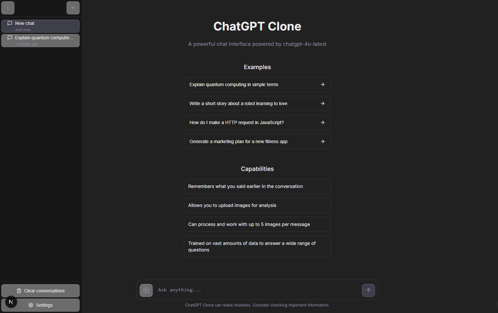

# ChatGPT Clone

A versatile chat interface for interacting with various AI language models through a clean, intuitive UI. This application lets users connect to OpenAI, Anthropic, and Google AI models using their own API keys.



## Features

- **Multi-Provider Support**: Seamlessly switch between OpenAI, Anthropic, and Google AI models
- **Response Streaming**: Real-time streaming responses from all supported providers
- **Rich Message Versioning**: Regenerate responses and maintain conversation branches
- **Image Upload**: Support for multimodal conversations with image uploads (up to 5MB per image)
- **Artifact Generation & Versioning**: Generate and maintain versions of code snippets and other artifacts
- **Syntax Highlighting**: Beautiful code highlighting for multiple programming languages
- **Math Formula Rendering**: Support for rendering mathematical formulas using KaTeX
- **Message Continuation**: Resume incomplete generations with the "continue" command
- **Customizable AI Parameters**: Adjust temperature, max tokens, and system prompts
- **Local Persistence**: Conversations, artifacts and settings saved to localStorage
- **Responsive Design**: Optimized for both desktop and mobile devices
- **Theme Support**: Toggle between light and dark mode
- **Client-Side Architecture**: Privacy-focused with user-provided API keys

### Advanced Data Architecture

This application implements a sophisticated graph-based data structure that enables powerful features while maintaining excellent performance:

- **Unified Store**: Single source of truth that manages all conversations, messages, and artifacts
- **Directed Graph Structure**: Messages and artifacts are nodes in a graph with directional links
- **Versioning System**: Artifacts maintain parent-child relationships for version history tracking
- **Reference System**: Messages can reference any artifact version for context
- **Branch Management**: Conversation branches are maintained with efficient pointers
- **Optimistic Updates**: UI reflects changes immediately while persistence happens asynchronously

### Planned Features

- Support for additional file types beyond images
- Image generation capabilities
- Persistent storage options beyond localStorage
- Collaborative editing of artifacts

## Getting Started

### Prerequisites

- Node.js 18.0 or later
- Modern web browser (Chrome, Edge, Firefox, etc.)
- API keys for providers you wish to use (OpenAI, Anthropic, and/or Google AI)

### Installation

1. Clone the repository:
   ```bash
   git clone https://github.com/yourusername/chatgpt-clone.git
   cd chatgpt-clone
   ```

2. Install dependencies:
   ```bash
   npm install
   ```

3. Start the development server:
   ```bash
   npm run dev
   ```

4. Open [http://localhost:3000](http://localhost:3000) in your browser

### Setting Up API Keys

1. Click on the settings icon in the sidebar
2. Select the provider tab you want to use
3. Enter your API key in the designated field
4. Save settings and start chatting

## Deployment

This application can be deployed on various platforms:

### Vercel (Recommended)
```bash
npm install -g vercel
vercel
```

### Netlify
```bash
npm install -g netlify-cli
netlify deploy
```

### Self-Hosted
```bash
npm run build
npm start
```

## Technical Architecture

### State Management

The application uses a sophisticated state management approach with Zustand and Immer to maintain a complex graph-based data structure:

```javascript
{
  conversations: {
    "conv-123": {
      id: "conv-123",
      title: "Conversation Title",
      firstMessageNodeId: "msg-abc",
      message_nodes: {
        "msg-abc": { 
          id: "msg-abc", 
          role: "user", 
          content: "...",
          nextMessageId: "msg-def",
          childrenMessageIds: ["msg-def", "msg-xyz"],  // For branching
          artifactsCreated: ["art-123"]  // References to artifacts
        },
        "msg-def": { ... }
      },
      artifact_nodes: {
        "art-123": {
          id: "art-123",
          content: "...",
          metadata: { type: "code", language: "javascript" },
          prevArtifactId: null,
          nextArtifactId: "art-456"  // Version history chain
        },
        "art-456": { ... }
      }
    }
  }
}
```

This structure enables:
- Efficient traversal of conversation chains (O(n) where n is chain length)
- Versioning of artifacts with bidirectional links (O(1) access to next/prev versions)
- Message branching with multiple alternate responses (tree structure)
- References between messages and artifacts (graph connections)
- Streaming updates that maintain structure integrity

### Streaming Artifact Parser

The application uses a custom streaming parser that can:

1. Process text streams in real-time from AI providers
2. Detect and parse artifact tags (`<artifact>...</artifact>`) even when split across chunks
3. Buffer content appropriately to minimize UI re-renders
4. Handle partial/incomplete artifacts with continuation support
5. Maintain state across streaming chunks for consistent rendering

The parser uses an optimized finite state machine approach that processes streaming chunks with minimal overhead, allowing for responsive UI updates even during complex artifact generation.

## Limitations

- **API Rate Limits**: The application is subject to the rate limits of the provider APIs based on your account tier
- **File Support**: Currently only supports image uploads up to 5MB per image
- **Browser Storage**: Conversations and artifacts are stored in browser localStorage and may be lost if cleared
- **Long Responses**: Very long AI generations might be cut off and require continuation

## Contributing

Contributions are welcome! Please feel free to submit a Pull Request.

1. Fork the project
2. Create your feature branch (`git checkout -b feature/AmazingFeature`)
3. Commit your changes (`git commit -m 'Add some AmazingFeature'`)
4. Push to the branch (`git push origin feature/AmazingFeature`)
5. Open a Pull Request

## License

This project is licensed under the MIT License - see the [LICENSE](LICENSE) file for details. 

## Attribution Request

While not required by the license, we appreciate if you provide a visible attribution to this project if you use it as a base for your application.

## Acknowledgments

- Built with [Next.js](https://nextjs.org/) and [React](https://reactjs.org/)
- UI components from [Radix UI](https://www.radix-ui.com/)
- Styling with [Tailwind CSS](https://tailwindcss.com/)
- State management with [Zustand](https://github.com/pmndrs/zustand)
- Code syntax highlighting with [highlight.js](https://highlightjs.org/)
- Math formula rendering with [KaTeX](https://katex.org/)
