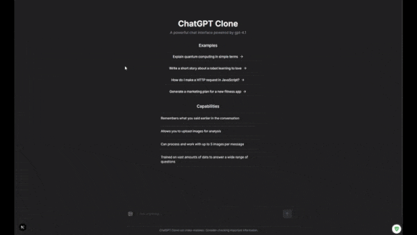

# ChatGPT Clone

A versatile chat interface for interacting with various AI language models through a clean, intuitive UI. This application lets users connect to OpenAI, Anthropic, and Google AI models using their own API keys.



## Features

- **Multi-Provider Support**: Seamlessly switch between OpenAI, Anthropic, and Google AI models
- **Multi-Provider Reasoning Models**: Support for OpenAI reasoning models (o3, o3-mini, o4-mini) and Anthropic extended thinking (Claude 3.7 Sonnet, Claude 4 Opus, Claude 4 Sonnet) with interactive reasoning display
- **Tool Use Support**: Integrated web search and code execution capabilities for Anthropic models with interactive tool selection
- **Response Streaming**: Real-time streaming responses from all supported providers
- **Rich Message Versioning**: Regenerate responses and maintain conversation branches
- **Multi-File Upload**: Support for comprehensive file attachments including images, documents, and code files (up to 5 files per message)
- **Enhanced File Support**: Support for 70+ file types including images, Microsoft Office documents, code files, archives, and more
- **Artifact Generation & Versioning**: Generate and maintain versions of code snippets and other artifacts
- **Syntax Highlighting**: Beautiful code highlighting for multiple programming languages
- **Math Formula Rendering**: Support for rendering mathematical formulas using KaTeX
- **Message Continuation**: Resume incomplete generations with the "continue" command
- **User Message Editing**: Edit and resend user messages with branching conversation support
- **Request Cancellation**: Cancel ongoing AI requests with graceful cleanup across all providers
- **File Generation Display**: Automatic detection and display of files generated by code execution
- **Drag & Drop File Upload**: Intuitive file upload with drag-and-drop support and visual feedback
- **Customizable AI Parameters**: Adjust temperature, max tokens, and system prompts
- **Local Persistence**: Conversations, artifacts and settings saved to localStorage
- **Responsive Design**: Optimized for both desktop and mobile devices
- **Theme Support**: Toggle between light and dark mode
- **Client-Side Architecture**: Privacy-focused with user-provided API keys

### Advanced Data Architecture

This application implements a sophisticated graph-based data structure that enables powerful features while maintaining excellent performance:

- **Unified Store**: Single source of truth that manages all conversations, messages, and artifacts
- **Directed Graph Structure**: Messages and artifacts are nodes in a graph with directional links
- **Versioning System**: Artifacts maintain parent-child relationships for version history tracking
- **Reference System**: Messages can reference any artifact version for context
- **Branch Management**: Conversation branches are maintained with efficient pointers
- **Optimistic Updates**: UI reflects changes immediately while persistence happens asynchronously

### Reasoning Models Support

This application provides comprehensive support for reasoning/thinking models from multiple providers with an enhanced chat experience:

#### OpenAI Reasoning Models
**Supported Models:** o3, o3-mini, o4-mini

**Features:**
- Uses OpenAI's `/responses` API endpoint for structured event streaming
- Handles official reasoning events (`response.output_item.added`, `response.reasoning_summary_text.delta`, etc.)
- Dynamic reasoning output index tracking for multiple reasoning steps
- Real-time streaming of reasoning process with step completion detection

#### Anthropic Extended Thinking
**Supported Models:** Claude 3.7 Sonnet, Claude 4 Opus, Claude 4 Sonnet

**Features:**
- Uses Anthropic's `thinking` parameter with configurable token budget
- Handles thinking content blocks with cryptographic signature verification
- Rich markdown formatting support within thinking steps (lists, paragraphs, etc.)
- Dynamic content block index tracking for proper content separation

#### Unified Reasoning Experience
**Shared Features:**
- **Interactive Reasoning Display**: Collapsible reasoning sections showing the model's thinking process
- **Real-time Reasoning Streaming**: Live updates as the model processes reasoning steps
- **Timeline Visualization**: Visual timeline layout for reasoning steps with connecting lines
- **Duration Tracking**: "Thought for Xs" indicators showing reasoning time
- **Rich Content Support**: Full markdown rendering including lists, formatting, and structure
- **Provider-Agnostic Architecture**: Consistent UI and behavior across different AI providers

**Implementation Details:**
- Generic event mapping system converts provider-specific events to unified reasoning states
- Unique step delimiter preserves natural formatting while maintaining clear step boundaries
- Comprehensive streaming documentation for both OpenAI and Anthropic API patterns
- Maintains reasoning state separate from main content in the chat store

### Tool Use Support

This application provides integrated tool use capabilities for enhanced AI interactions:

#### Anthropic Tool Use
**Supported Models:** All Claude models (Claude 3.7 Sonnet, Claude 3.5 Sonnet, Claude 3.5 Haiku, Claude 4 Opus, Claude 4 Sonnet)

**Available Tools:**
- **Web Search**: Real-time web search for current information with clickable result pills
- **Code Execution**: Secure Python sandbox execution with stdout/stderr/exit_code display

**Features:**
- **Interactive Tool Selection**: Toggle tools on/off with visual pill interface below message input
- **Real-time Tool Execution**: Live streaming of tool use within reasoning timeline
- **Custom Result Display**: Specialized rendering for different tool output types
- **Global Tool Settings**: Tool preferences persist across conversations
- **Visual Tool Indicators**: Clear icons and status indicators for tool execution

#### Tool Use Experience
- **Seamless Integration**: Tools appear naturally within the reasoning/thinking timeline
- **Rich Output Formatting**: Code execution shows formatted stdout/stderr with syntax highlighting
- **Web Search Pills**: Search results displayed as clickable pills for easy navigation
- **Tool Status Tracking**: Visual indicators for tool setup, execution, and completion
- **Provider-Agnostic Design**: Extensible architecture ready for additional providers and tools

**Current Tool Limitations:**
- Tool use only available for Anthropic models
- Limited to web search and code execution tools

### File Upload & Attachment System

This application provides comprehensive file upload capabilities with intelligent handling:

#### Supported File Types (70+)
- **Images**: PNG, JPG, JPEG, GIF, WebP, SVG
- **Documents**: PDF, TXT, MD, CSV, JSON
- **Microsoft Office**: DOC, DOCX, XLS, XLSX, PPT, PPTX, MSG, VSD, MPP
- **Programming Languages**: Python, JavaScript, TypeScript, Java, C#, C/C++, PHP, Go, Rust, Swift, Kotlin, Ruby, R, MATLAB, Scala, Perl, Dart, Julia, VBA, Lua, and more
- **Web Technologies**: HTML, CSS, XML
- **Configuration**: YAML, TOML, INI, CONF
- **Archives**: ZIP, RAR, 7Z, TAR, GZ
- **Other**: SQL, Shell scripts, Assembly, Fortran, Pascal, and specialized formats

#### File Upload Features
- **Multi-File Support**: Upload up to 5 files per message
- **Drag & Drop Interface**: Intuitive file dropping with visual feedback
- **Provider-Aware Validation**: Different size limits and validation rules per AI provider
- **File Preview Cards**: Rich preview with file icons, names, and sizes
- **Intelligent File Icons**: Over 70 unique file type icons for easy identification
- **Size Limits**: 
  - **Anthropic**: Images up to 20MB, PDFs up to 32MB
  - **OpenAI**: Images up to 20MB, Documents up to 50MB, Other files up to 100MB
- **Generated File Display**: Automatic detection and download of files created by code execution

#### Technical Implementation
- **Centralized File Type System**: Unified file type definitions, MIME mappings, and icon system
- **Provider-Specific Handling**: Different upload and processing logic per AI provider
- **Streaming File Processing**: Real-time file processing with progress indicators
- **Attachment vs Image Separation**: Clean separation between image content and file attachments

### Planned Features

- **Expanded Tool Support**: Additional tools like image generation, document analysis, and file operations
- **Multi-Provider Tool Use**: Extend tool capabilities to OpenAI and Google AI models
- **Enhanced Reasoning Tools**: Web search and code execution for reasoning models via delegated tool calls
- **Advanced File Processing**: OCR for images, document parsing, and content extraction
- Image generation capabilities
- Persistent storage options beyond localStorage
- Collaborative editing of artifacts

## Getting Started

### Prerequisites

- Node.js 18.0 or later
- Modern web browser (Chrome, Edge, Firefox, etc.)
- API keys for providers you wish to use (OpenAI, Anthropic, and/or Google AI)

### Installation

1. Clone the repository:
   ```bash
   git clone https://github.com/yourusername/chatgpt-clone.git
   cd chatgpt-clone
   ```

2. Install dependencies:
   ```bash
   npm install
   ```

3. Start the development server:
   ```bash
   npm run dev
   ```

4. Open [http://localhost:3000](http://localhost:3000) in your browser

### Setting Up API Keys

1. Click on the settings icon in the sidebar
2. Select the provider tab you want to use
3. Enter your API key in the designated field
4. For Anthropic models, configure available tools:
   - Toggle **Web Search** for real-time internet information
   - Toggle **Code Execution** for Python sandbox capabilities
5. Upload files by:
   - Clicking the paperclip icon in the message input
   - Dragging and dropping files directly onto the input area
   - Supports up to 5 files per message with automatic type detection
6. Save settings and start chatting

## Deployment

This application can be deployed on various platforms:

### Vercel (Recommended)
```bash
npm install -g vercel
vercel
```

### Netlify
```bash
npm install -g netlify-cli
netlify deploy
```

### Self-Hosted
```bash
npm run build
npm start
```

## Technical Architecture

### State Management

The application uses a sophisticated state management approach with Zustand and Immer to maintain a complex graph-based data structure:

```javascript
{
  conversations: {
    "conv-123": {
      id: "conv-123",
      title: "Conversation Title",
      firstMessageNodeId: "msg-abc",
      message_nodes: {
        "msg-abc": { 
          id: "msg-abc", 
          role: "user", 
          content: "...",
          nextMessageId: "msg-def",
          childrenMessageIds: ["msg-def", "msg-xyz"],  // For branching
          artifactsCreated: ["art-123"]  // References to artifacts
        },
        "msg-def": { ... }
      },
      artifact_nodes: {
        "art-123": {
          id: "art-123",
          content: "...",
          metadata: { type: "code", language: "javascript" },
          prevArtifactId: null,
          nextArtifactId: "art-456"  // Version history chain
        },
        "art-456": { ... }
      }
    }
  }
}
```

This structure enables:
- Efficient traversal of conversation chains (O(n) where n is chain length)
- Versioning of artifacts with bidirectional links (O(1) access to next/prev versions)
- Message branching with multiple alternate responses (tree structure)
- References between messages and artifacts (graph connections)
- Streaming updates that maintain structure integrity

### Streaming Artifact Parser

The application uses a custom streaming parser that can:

1. Process text streams in real-time from AI providers
2. Detect and parse artifact tags (`<artifact>...</artifact>`) even when split across chunks
3. Buffer content appropriately to minimize UI re-renders
4. Handle partial/incomplete artifacts with continuation support
5. Maintain state across streaming chunks for consistent rendering

The parser uses an optimized finite state machine approach that processes streaming chunks with minimal overhead, allowing for responsive UI updates even during complex artifact generation.

## Limitations

- **API Rate Limits**: The application is subject to the rate limits of the provider APIs based on your account tier
- **File Size Limits**: File uploads are limited by provider constraints (see File Upload section for specific limits)
- **Browser Storage**: Conversations and artifacts are stored in browser localStorage and may be lost if cleared
- **Long Responses**: Very long AI generations might be cut off and require continuation
- **File Processing**: Some file types may require additional processing or may not be fully supported by all AI providers

## Contributing

Contributions are welcome! Please feel free to submit a Pull Request.

1. Fork the project
2. Create your feature branch (`git checkout -b feature/AmazingFeature`)
3. Commit your changes (`git commit -m 'Add some AmazingFeature'`)
4. Push to the branch (`git push origin feature/AmazingFeature`)
5. Open a Pull Request

## License

This project is licensed under the MIT License - see the [LICENSE](LICENSE) file for details. 

## Attribution Request

While not required by the license, we appreciate if you provide a visible attribution to this project if you use it as a base for your application.

## Acknowledgments

- Built with [Next.js](https://nextjs.org/) and [React](https://reactjs.org/)
- UI components from [Radix UI](https://www.radix-ui.com/)
- Styling with [Tailwind CSS](https://tailwindcss.com/)
- State management with [Zustand](https://github.com/pmndrs/zustand)
- Code syntax highlighting with [highlight.js](https://highlightjs.org/)
- Math formula rendering with [KaTeX](https://katex.org/)
